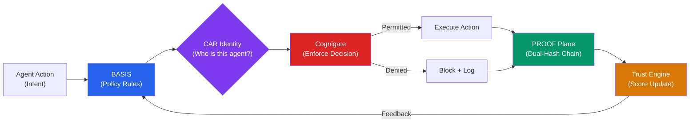
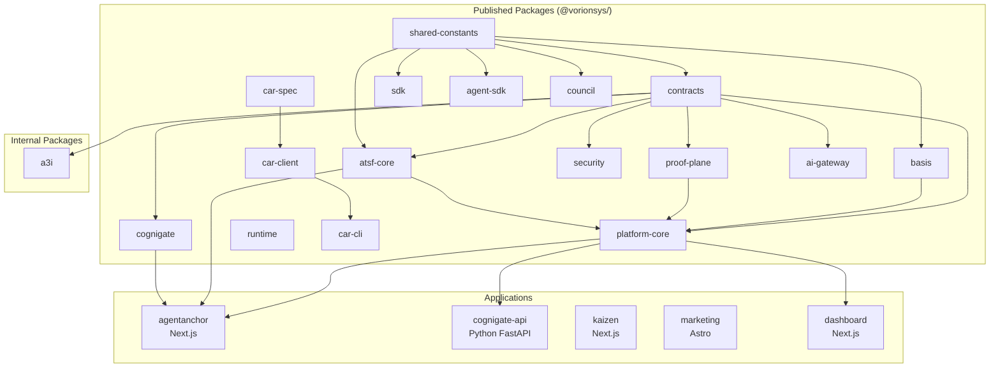

# Vorion

**Governed AI Execution Platform**

[](https://github.com/vorionsys/vorion/actions/workflows/ci.yml)
[](https://github.com/vorionsys/vorion/actions/workflows/ci-python.yml)
[](https://github.com/vorionsys/vorion/actions/workflows/secrets-scan.yml)
[](LICENSE)
[](docs/VORION_V1_FULL_APPROVAL_PDFS/ISO_42001_GAP_ANALYSIS.md)
[](docs/VORION_V1_FULL_APPROVAL_PDFS/AI_TRISM_COMPLIANCE_MAPPING.md)
[](#)
[](https://www.npmjs.com/package/@vorionsys/shared-constants)
[](https://www.npmjs.com/package/@vorionsys/basis)
[](https://www.npmjs.com/package/@vorionsys/atsf-core)
[](https://www.npmjs.com/package/@vorionsys/contracts)
[](https://www.npmjs.com/package/@vorionsys/car-spec)
[](https://www.npmjs.com/package/@vorionsys/cognigate)
[](https://www.npmjs.com/package/@vorionsys/proof-plane)
[](https://www.npmjs.com/package/@vorionsys/council)
[](https://www.npmjs.com/package/@vorionsys/ai-gateway)
[](https://www.npmjs.com/package/@vorionsys/sdk)
[](https://www.npmjs.com/package/@vorionsys/runtime)
[](https://www.npmjs.com/package/@vorionsys/agent-sdk)
[](https://www.npmjs.com/package/@vorionsys/car-client)
[](https://www.npmjs.com/package/@vorionsys/car-cli)
[](https://www.npmjs.com/package/@vorionsys/security)
[](https://www.npmjs.com/package/@vorionsys/platform-core)

> **Security Notice**: The only official Vorion repositories are hosted at [github.com/vorionsys](https://github.com/vorionsys). Be aware that threat actors have used similar-sounding names (e.g., "Vortax", "VorTion") for credential-stealing malware campaigns. Always verify the source before downloading software. Official releases are cryptographically signed.

---

## Quick Install

```bash
# Foundation (start here)
npm install @vorionsys/shared-constants   # trust tiers, constants
npm install @vorionsys/contracts          # Zod schemas, DB types
npm install @vorionsys/basis              # BASIS rule engine
npm install @vorionsys/atsf-core          # trust scoring framework

# Governance & Enforcement
npm install @vorionsys/cognigate          # policy enforcement SDK
npm install @vorionsys/council            # 16-agent governance orchestrator
npm install @vorionsys/ai-gateway         # multi-provider AI routing
npm install @vorionsys/proof-plane        # tamper-evident audit chain
npm install @vorionsys/security           # crypto, DPoP, Merkle modules

# SDKs & Clients
npm install @vorionsys/sdk                # platform SDK
npm install @vorionsys/agent-sdk          # agent-facing SDK
npm install @vorionsys/runtime            # agent runtime environment
npm install @vorionsys/car-spec           # CAR specification
npm install @vorionsys/car-client         # CAR API client
npm install @vorionsys/car-cli            # CAR CLI tooling
npm install @vorionsys/platform-core      # trust engine & enforcement
```

---

## Overview

Vorion is the governance infrastructure that AI needs before the world needs it. It is an enterprise platform that enforces constraint-based governance, trust-scored autonomy, and cryptographically verifiable audit trails for autonomous AI agents -- enabling organizations to deploy AI systems that are accountable by design, compliant by architecture, and auditable by anyone. Built on control theory principles (STPA) and the open BASIS specification, Vorion provides the runtime enforcement layer between "what an AI agent wants to do" and "what it is allowed to do."

Key capabilities:

- **Constraint-Based Governance** - Define what AI can and cannot do
- **Trust-Based Autonomy** - Graduated autonomy levels based on behavioral trust
- **Immutable Evidence** - Cryptographic proof chain with optional Merkle tree aggregation
- **Zero-Knowledge Audits** - Privacy-preserving trust verification via ZK proofs **(development; Schnorr-based, production SNARK integration planned)**
- **Stepped Trust Decay** - 182-day half-life with behavioral milestones
- **Low-Latency Enforcement** - Low-latency policy evaluation **(target: sub-millisecond; based on development benchmarks)**

```
┌─────────────────────────────────────────────────────────────────────┐
│                      VORION ARCHITECTURE                             │
├─────────────────────────────────────────────────────────────────────┤
│                                                                      │
│    ┌─────────┐     ┌─────────┐     ┌─────────┐     ┌─────────┐     │
│    │ INTENT  │────►│  BASIS  │────►│ ENFORCE │────►│COGNIGATE│     │
│    │ (Goals) │     │ (Rules) │     │(Decide) │     │(Execute)│     │
│    └─────────┘     └─────────┘     └─────────┘     └────┬────┘     │
│                                                          │          │
│                                                          ▼          │
│    ┌─────────────────────────────────────────────────────────┐     │
│    │                        PROOF                             │     │
│    │              (Immutable Evidence Chain)                  │     │
│    └─────────────────────────────────────────────────────────┘     │
│                              │                                      │
│                              ▼                                      │
│    ┌─────────────────────────────────────────────────────────┐     │
│    │                    TRUST ENGINE                          │     │
│    │              (Behavioral Trust Scoring)                  │     │
│    └─────────────────────────────────────────────────────────┘     │
│                                                                      │
└─────────────────────────────────────────────────────────────────────┘
```

### Governance Flow (Mermaid)



### Package Dependency Graph



---

## Core Components

| Component | Description | Status |
|-----------|-------------|--------|
| **CAR Spec** | Categorical Agentic Registry specification | Published (v1.1.0) |
| **BASIS** | Rule engine for constraint evaluation | Architecture Complete |
| **INTENT** | Goal and context processing | Architecture Complete |
| **ENFORCE** | Policy decision point | Architecture Complete |
| **Cognigate** | Constrained execution runtime | In Development |
| **PROOF** | Immutable evidence chain with Merkle aggregation | Implemented |
| **Trust Engine** | Behavioral trust scoring with stepped decay | Architecture Complete |
| **ZK Audit** | Zero-knowledge proof generation for privacy-preserving audits | Specified |
| **Merkle Service** | Batch verification and Merkle tree aggregation | Implemented |
| **DPoP** | RFC 9449 token binding with Redis-backed JTI cache | Implemented (~1,200 LOC) |
| **TEE** | Trusted Execution Environment integration | Scaffolded (interfaces defined) |
| **External Anchoring** | Blockchain anchoring for proof chain | Planned (DB schema ready) |

### Implementation Status

| Component | Status | Notes |
|-----------|--------|-------|
| BASIS | Published | `@vorionsys/basis` on npm |
| CAR Spec | Published | `@vorionsys/car-spec@1.1.0` |
| ATSF Core | Published | `@vorionsys/atsf-core` |
| Shared Constants | Published | `@vorionsys/shared-constants` |
| Contracts | Published | `@vorionsys/contracts` |
| A3I | Development | 637+ tests passing (NIST SP 800-53, AI RMF, SSDF, adversarial) |
| Platform Core | Development | 82+ tests |
| Cognigate | Development | SDK published |
| PROOF Plane | Development | Hash chain + Merkle implemented |
| Security | Development | Crypto, DPoP, Merkle modules |
| Auth | Implemented | 120 tests, Supabase + RBAC |
| DPoP | Implemented | ~1,200 LOC, Redis JTI cache |
| Merkle | Implemented | 646 LOC, batch aggregation |
| TEE | Scaffolded | Interfaces defined, SDK integration required |
| External Anchoring | Planned | DB schema ready, no chain integration |

---

## Quick Start

### Prerequisites

- Node.js 20+
- Docker (for local development)
- Git
- PostgreSQL 15+
- Redis 7+

### Installation

```bash
# Clone the repository
git clone https://github.com/vorionsys/vorion.git
cd vorion

# Install dependencies
npm install

# Copy environment configuration
cp configs/environments/.env.example .env

# Edit .env with your database and Redis credentials
# See CONFIG_REFERENCE.md for all configuration options

# Start development environment
npm run dev
```

### Basic Usage (TypeScript/Node.js)

```typescript
import { IntentService, createIntentService } from '@vorionsys/platform-core';

// Create the intent service (requires database and Redis connections)
const intentService = createIntentService();

// Submit an intent for governance
const result = await intentService.submit({
  entityId: 'ent_abc123',  // UUID of the entity/agent
  goal: 'Process customer refund',
  context: {
    customer_id: 'cust_123',
    amount: 150.00,
    reason: 'defective_product'
  }
});

console.log(`Intent ID: ${result.id}`);
console.log(`Status: ${result.status}`);
```

See [examples/hello-world.ts](examples/hello-world.ts) for a complete working example.

---

## Project Structure

Turborepo monorepo with npm workspaces (25 packages, 12 apps):

```
vorion/
├── packages/                        # Shared libraries
│   ├── shared-constants/            # Canonical trust tiers, role mappings (published)
│   ├── contracts/                   # Zod schemas, Drizzle DB tables, shared types (published)
│   ├── basis/                       # BASIS rule engine (published)
│   ├── atsf-core/                   # ATSF trust scoring framework (published)
│   ├── cognigate/                   # Cognigate enforcement SDK (published)
│   ├── car-spec/                    # CAR specification (published, v1.1.0)
│   ├── platform-core/              # Trust engine, governance, enforcement, proof
│   ├── proof-plane/                 # Dual-hash (SHA-256 + SHA3-256) audit chain
│   ├── a3i/                         # Agent orchestration layer (637+ tests, NIST compliance + KYA bridge)
│   ├── security/                    # Crypto, DPoP, Merkle modules
│   ├── runtime/                     # Agent runtime environment
│   ├── sdk/                         # Platform SDK
│   ├── agent-sdk/                   # Agent-facing SDK
│   ├── agentanchor-sdk/             # AgentAnchor TypeScript SDK
│   ├── agentanchor-sdk-go/          # AgentAnchor Go SDK
│   ├── agentanchor-sdk-python/      # AgentAnchor Python SDK
│   ├── car-client/                  # CAR API client
│   ├── car-cli/                     # CAR CLI tooling
│   ├── car-python/                  # CAR Python client
│   ├── council/                     # Council governance module
│   ├── ai-gateway/                  # AI provider gateway
│   ├── infrastructure/              # Infrastructure-as-code utilities
│   ├── design-tokens/               # Shared design tokens
│   └── ts-fixer/                    # TypeScript migration tooling
├── apps/                            # Deployable applications
│   ├── agentanchor/                 # B2B governance portal (Next.js + React 19)
│   ├── agentanchor-www/             # Product marketing site (Next.js)
│   ├── cognigate-api/               # Cognigate API (Python FastAPI)
│   ├── kaizen/                      # Learning platform (Next.js)
│   ├── dashboard/                   # Operational dashboard (Next.js)
│   ├── vorion-admin/                # Admin panel (Next.js)
│   ├── aurais/                      # AI interface (Next.js)
│   ├── marketing/                   # Landing pages (Astro, multi-domain)
│   ├── api/                         # Core API service
│   ├── status-www/                  # Status page (Next.js)
│   ├── bai-cc-www/                  # BAI CC site
│   └── bai-cc-dashboard/            # BAI CC dashboard
├── docs/
│   ├── adr/                         # Architecture Decision Records (20 ADRs)
│   ├── compliance/                  # NIST AI RMF, COSAiS, OWASP ASI mappings
│   ├── basis-docs/                  # BASIS specification (Docusaurus)
│   ├── constitution/                # Governance constitution
│   ├── specs/                       # Technical specifications (ZK, Merkle)
│   └── VORION_V1_FULL_APPROVAL_PDFS/  # Security, STPA, operations docs
├── compliance/                      # OSCAL, governance matrix, control registry
├── drizzle/                         # Database migrations (RLS, tenant isolation)
├── .github/workflows/               # CI/CD (lint, typecheck, build, test, SAST, secrets)
├── e2e/                             # End-to-end tests (Playwright)
├── k6/                              # Performance tests (k6)
├── monitoring/                      # Observability configuration
├── configs/                         # Environment configurations
└── examples/                        # Example implementations
```

---

## Documentation

### Getting Started

- [Configuration Reference](docs/CONFIG_REFERENCE.md) - All environment variables and settings
- [Troubleshooting Guide](docs/TROUBLESHOOTING.md) - Common issues and solutions
- [Hello World Example](examples/hello-world.ts) - Working example code

### Core Documentation

- [Developer Quick Start](docs/VORION_V1_FULL_APPROVAL_PDFS/DEVELOPER_QUICK_START.md)
- [STPA Implementation Guide](docs/VORION_V1_FULL_APPROVAL_PDFS/STPA_IMPLEMENTATION_GUIDE.md)
- [Platform Operations Runbook](docs/VORION_V1_FULL_APPROVAL_PDFS/PLATFORM_OPERATIONS_RUNBOOK.md)

### Technical Specifications

- [SPEC-001: ZK Audit & Merkle Tree Enhancement](docs/specs/SPEC-001-zk-audit-merkle-enhancement.md) - Zero-knowledge proofs, Merkle aggregation, stepped decay model

### Architecture Decision Records

20 ADRs document key technical decisions: [docs/adr/](docs/adr/)

**Platform Decisions:**

| ADR | Decision |
|-----|----------|
| [ADR-001](docs/adr/ADR-001-monorepo-turborepo.md) | Monorepo with Turborepo |
| [ADR-002](docs/adr/ADR-002-nextjs-react-19.md) | Next.js with React 19 |
| [ADR-003](docs/adr/ADR-003-supabase-auth-rls.md) | Supabase Auth with Row-Level Security |
| [ADR-004](docs/adr/ADR-004-drizzle-orm.md) | Drizzle ORM for Database Access |
| [ADR-005](docs/adr/ADR-005-proof-plane-dual-hash.md) | Proof Plane Dual-Hash Audit Chain |

**Governance Architecture:**

| ADR | Decision |
|-----|----------|
| [ADR-001](docs/adr/ADR-001-a3i-fast-data-layer.md) | A3I as Fast Data Layer |
| [ADR-002](docs/adr/ADR-002-8-tier-trust-model.md) | 8-Tier Trust Model |
| [ADR-013](docs/adr/ADR-013-monorepo-turborepo.md) | Monorepo with Turborepo (detailed) |
| [ADR-015](docs/adr/ADR-015-supabase-auth-rls.md) | Supabase Auth with RLS (detailed) |
| [ADR-016](docs/adr/ADR-016-drizzle-orm.md) | Drizzle ORM (detailed) |
| [ADR-017](docs/adr/ADR-017-proof-plane-dual-hash.md) | Proof Plane Dual-Hash (detailed) |
| [ADR-018](docs/adr/ADR-018-car-string-semantics.md) | CAR String Semantics |

### Compliance & Security

- [NIST AI RMF Compliance Mapping](docs/compliance/nist-ai-rmf-mapping.md) - Detailed control-level mapping across Govern, Map, Measure, Manage
- [NIST COSAiS Alignment](docs/compliance/NIST-COSAiS-ALIGNMENT.md) - SP 800-53 control overlay for AI systems
- [OWASP ASI Mapping](docs/compliance/OWASP-ASI-MAPPING.md) - Top 10 for Agentic Applications mapping
- [SECURITY.md](SECURITY.md) - Vulnerability disclosure policy
- [Security Whitepaper](docs/VORION_V1_FULL_APPROVAL_PDFS/SECURITY_WHITEPAPER_ENTERPRISE.md)
- [ISO 42001 Gap Analysis](docs/VORION_V1_FULL_APPROVAL_PDFS/ISO_42001_GAP_ANALYSIS.md)

---

## Development

### Quick Start for Contributors

```bash
# 1. Clone and install
git clone https://github.com/vorionsys/vorion.git
cd vorion
npm install                          # Uses npm 10.8.2 with workspaces

# 2. Build all packages (respects dependency graph via Turborepo)
npx turbo build

# 3. Run all tests
npx turbo test

# 4. Typecheck all packages
npx turbo typecheck

# 5. Lint
npx turbo lint
```

### Common Development Commands

```bash
# Run a specific package's tests
npx turbo test --filter="@vorionsys/contracts"
npx turbo test --filter="@vorionsys/proof-plane"

# Build a specific app
npx turbo build --filter="@vorion/agentanchor"

# Start dev server for a specific app
npx turbo dev --filter="@vorion/agentanchor"

# Database operations
npx turbo db:generate                # Generate migration files from schema changes
npx turbo db:migrate                 # Apply migrations
npx turbo db:seed                    # Seed development data

# Quality checks
npx turbo format:check               # Check formatting
npx turbo lint:fix                   # Auto-fix lint issues
npm run check:circular               # Detect circular dependencies (madge)
npm run security:audit               # npm audit (high/critical)
```

### Technology Stack

| Layer | Technology | Notes |
|-------|-----------|-------|
| Monorepo | Turborepo + npm workspaces | 25 packages, 12 apps |
| Language | TypeScript 5.9+ (strict) | Shared `tsconfig.base.json` |
| Runtime | Node.js 20+ | ESM modules (`"type": "module"`) |
| Web Framework | Next.js (App Router) + React 19 | 7 Next.js apps |
| API Framework | Fastify 5 | With CORS, Helmet, JWT, rate limiting |
| Database | PostgreSQL 15+ (Drizzle ORM) | RLS for tenant isolation |
| Auth | Supabase Auth | JWT + SSR middleware |
| Cache | Redis 7+ (ioredis) | Session, JTI cache, BullMQ |
| Testing | Vitest + Stryker (mutation) | 9,976+ TS tests + 692 Python |
| CI/CD | GitHub Actions | Lint, typecheck, build, test, SAST, secrets |
| SAST | Semgrep (blocking) | Every push |
| Secrets | gitleaks (blocking) | Every push |
| Observability | OpenTelemetry + Pino + Prometheus | Traces, logs, metrics |
| Python | FastAPI (cognigate-api) | Python CI separate |

---

## Contributing

We welcome contributions from partners and the community. Please see our [Contributing Guide](CONTRIBUTING.md) for details on:

- Code of Conduct
- Development workflow
- Pull request process
- Coding standards

---

## Architecture Principles

### Control Theory Foundation

Vorion is built on **STPA (Systems-Theoretic Process Analysis)** principles:

- **Controller**: BASIS + ENFORCE evaluate constraints
- **Actuator**: Cognigate enforces decisions
- **Controlled Process**: AI agent execution
- **Sensor**: PROOF + Trust Engine provide feedback

### Trust Model (BASIS Specification)

Trust tiers are defined in `@vorionsys/shared-constants` - the single source of truth for the Vorion ecosystem.

| Tier | Score | Name | Autonomy |
|------|-------|------|----------|
| T0 | 0-199 | Sandbox | Isolated environment, no external access |
| T1 | 200-349 | Observed | Read-only operations, fully monitored |
| T2 | 350-499 | Provisional | Basic operations with supervision |
| T3 | 500-649 | Monitored | Standard operations with active monitoring |
| T4 | 650-799 | Standard | External API access, policy-governed |
| T5 | 800-875 | Trusted | Cross-agent communication enabled |
| T6 | 876-950 | Certified | Administrative tasks, minimal oversight |
| T7 | 951-1000 | Autonomous | Full autonomy, self-governance |

```typescript
// Import from shared constants
import { TrustTier, TIER_THRESHOLDS, scoreToTier } from '@vorionsys/shared-constants';

const tier = scoreToTier(750); // TrustTier.T4_STANDARD
const info = TIER_THRESHOLDS[tier]; // { min: 650, max: 799, name: 'Standard' }
```

### Trust Score Decay

Trust scores decay over inactivity using a **stepped decay model** with 182-day half-life:

| Days Inactive | Score Factor | Effect |
|---------------|--------------|--------|
| 0-6 | 100% | Grace period |
| 7 | ~93% | Early warning |
| 14 | ~87% | Two-week checkpoint |
| 28 | ~80% | One-month threshold |
| 56 | ~70% | Two-month mark |
| 112 | ~58% | Four-month drop |
| 182 | 50% | **Half-life reached** |

Activity resets the decay clock. Positive signals can provide recovery bonuses.

### Proof Chain & Audit System

The PROOF component provides cryptographic evidence for every governance decision:

**Baseline Security (Required):**
- Linear hash-chain linking (tamper-evident)
- Cryptographic signatures (Ed25519/ECDSA)
- Per-entity chain isolation

**Enhanced Security (Optional):**
- **Merkle Tree Aggregation** - Batch verification, O(log n) proof verification
- **External Anchoring** - Ethereum, Polygon, RFC 3161 Timestamp Authority
- **Zero-Knowledge Proofs** - Privacy-preserving trust attestation

**Audit Modes:**

| Mode | Description | Use Case |
|------|-------------|----------|
| Full | Complete proof chain export | Regulatory compliance |
| Selective | Filtered, redacted disclosure | Partner due diligence |
| ZK | Zero-knowledge claims only | Privacy-preserving verification |

**ZK Claim Types:**
- `score_gte_threshold` - Prove score meets minimum without revealing actual value
- `trust_level_gte` - Prove trust level without revealing score
- `decay_milestone_lte` - Prove recent activity without revealing exact dates
- `chain_valid` - Prove proof chain integrity

### Security

- Zero Trust Architecture with Defense in Depth
- Supabase Auth + PostgreSQL Row-Level Security (RLS) for tenant isolation
- Cryptographic integrity: SHA-256 + SHA3-256 dual-hash proof chain
- Semgrep SAST scanning on every push (blocking)
- Gitleaks secret scanning, npm audit (critical/high blocking)

See [SECURITY.md](SECURITY.md) for vulnerability reporting and [security.txt](security.txt) for machine-readable policy.

---

## Compliance

Vorion is designed to align with the following frameworks **(not yet certified or audited)**:

- **NIST AI RMF** - [Detailed compliance mapping](docs/compliance/nist-ai-rmf-mapping.md) across Govern, Map, Measure, Manage (~86% coverage)
- **NIST SP 800-53** - 370 controls implemented in [OSCAL SSP](compliance/oscal/ssp-draft.json) (OSCAL 1.1.2, validated). Automated verification: 52 controls, 20 tests.
- **NIST COSAiS** - [SP 800-53 control overlay](docs/compliance/NIST-COSAiS-ALIGNMENT.md) for AI systems (Use Cases 3 & 4)
- **NIST CAISI RFI** - Submitted response to Docket NIST-2025-0035 (March 2026) covering AI agent security threat taxonomy, technical controls, and runtime governance standards. See [docs/nist-caisi-rfi-response-2026-02.md](docs/nist-caisi-rfi-response-2026-02.md).
- **OWASP ASI** - [Top 10 for Agentic Applications](docs/compliance/OWASP-ASI-MAPPING.md) mapping (ASI01–ASI10)
- **EU AI Act** - Ceiling enforcement caps high-risk AI systems, transparency requirements
- **ISO/IEC 42001** - AI management system principles ([gap analysis complete](docs/VORION_V1_FULL_APPROVAL_PDFS/ISO_42001_GAP_ANALYSIS.md))
- **SOC 2 Type II** - Security controls via RLS, audit chain, SAST (audit planned Q4 2026)

### OSCAL Artifacts

| Artifact | File | Status |
|----------|------|--------|
| System Security Plan | [compliance/oscal/ssp-draft.json](compliance/oscal/ssp-draft.json) | 370 controls, OSCAL 1.1.2 ✅ |
| Component Definition | [compliance/oscal/component-definition.json](compliance/oscal/component-definition.json) | OSCAL 1.1.2 ✅ |
| Assessment Plan | [compliance/oscal/assessment-plan.json](compliance/oscal/assessment-plan.json) | OSCAL 1.1.2 ✅ |
| POA&M | [compliance/oscal/poam.json](compliance/oscal/poam.json) | OSCAL 1.1.2 ✅ |

Run `python tools/validate-oscal-ssp.py` to validate all artifacts locally.

---

## Roadmap

### Phase 1-5: Foundation (Complete)
- [x] Core component implementation
- [x] Basic rule engine (BASIS)
- [x] Intent processing
- [x] PROOF evidence system
- [x] Trust Engine with stepped decay (182-day half-life)
- [x] CAR Specification published (`@vorionsys/car-spec@1.1.0`)
- [x] 82+ tests passing, 0-1000 trust scale

### Phase 6: Architecture (Complete - January 2026)
- [x] All 5 architecture decisions finalized
- [x] Kernel-level ceiling enforcement (1000-point cap)
- [x] Context immutability at agent instantiation
- [x] Dual-layer role gates (kernel + BASIS)
- [x] Hybrid weight presets (ACI spec + Axiom deltas)
- [x] Creation modifiers at instantiation time

### Phase 7: Implementation (Q1-Q2 2026)
- [x] Signal pipeline (fast + slow lanes, `TrustSignalPipeline`)
- [x] KYA `AccountabilityChain` → `TrustSignalPipeline` bridge (`CT-ACCT` factor propagation)
- [x] NIST CAISI RFI submitted (Docket NIST-2025-0035, March 2026)
- [x] OSCAL SSP expanded to 370 NIST SP 800-53 controls
- [ ] 200+ unit tests at <1ms P99 latency target
- [ ] Merkle tree aggregation for proof chain
- [ ] Zero-knowledge proof system (Circom/Groth16)
- [ ] ACI standard publication (OpenID Foundation, W3C)

### Phase 8: Security Hardening (Q3 2026)
- [x] DPoP token binding
- [ ] TEE (Trusted Execution Environment) support
- [ ] Semantic governance layer

### Phase 9: Enterprise & Ecosystem (Q4 2026)
- [ ] Multi-tenant support
- [ ] Enterprise integrations
- [ ] Partner SDK
- [ ] 5+ enterprise deployments target

---

## Ecosystem

### Published Packages

**Foundation**

| Package | npm | Description |
|---------|-----|-------------|
| [`@vorionsys/shared-constants`](https://www.npmjs.com/package/@vorionsys/shared-constants) | [](https://www.npmjs.com/package/@vorionsys/shared-constants) | Canonical trust tiers, role mappings, provenance types |
| [`@vorionsys/contracts`](https://www.npmjs.com/package/@vorionsys/contracts) | [](https://www.npmjs.com/package/@vorionsys/contracts) | Zod schemas, Drizzle DB table definitions, shared validators |
| [`@vorionsys/basis`](https://www.npmjs.com/package/@vorionsys/basis) | [](https://www.npmjs.com/package/@vorionsys/basis) | BASIS rule engine — 182-day stepped trust decay, 8-tier scoring |
| [`@vorionsys/atsf-core`](https://www.npmjs.com/package/@vorionsys/atsf-core) | [](https://www.npmjs.com/package/@vorionsys/atsf-core) | ATSF trust scoring framework |
| [`@vorionsys/car-spec`](https://www.npmjs.com/package/@vorionsys/car-spec) | [](https://www.npmjs.com/package/@vorionsys/car-spec) | CAR (Categorical Agentic Registry) specification v1.1.0 |

**Governance & Enforcement**

| Package | npm | Description |
|---------|-----|-------------|
| [`@vorionsys/cognigate`](https://www.npmjs.com/package/@vorionsys/cognigate) | [](https://www.npmjs.com/package/@vorionsys/cognigate) | Cognigate policy enforcement SDK |
| [`@vorionsys/council`](https://www.npmjs.com/package/@vorionsys/council) | [](https://www.npmjs.com/package/@vorionsys/council) | 16-agent governance orchestrator |
| [`@vorionsys/ai-gateway`](https://www.npmjs.com/package/@vorionsys/ai-gateway) | [](https://www.npmjs.com/package/@vorionsys/ai-gateway) | AI provider gateway with policy enforcement |
| [`@vorionsys/proof-plane`](https://www.npmjs.com/package/@vorionsys/proof-plane) | [](https://www.npmjs.com/package/@vorionsys/proof-plane) | Dual-hash (SHA-256 + SHA3-256) tamper-evident audit chain |
| [`@vorionsys/security`](https://www.npmjs.com/package/@vorionsys/security) | [](https://www.npmjs.com/package/@vorionsys/security) | Crypto, DPoP, and Merkle modules |

**SDKs & Clients**

| Package | npm | Description |
|---------|-----|-------------|
| [`@vorionsys/sdk`](https://www.npmjs.com/package/@vorionsys/sdk) | [](https://www.npmjs.com/package/@vorionsys/sdk) | Platform SDK for building on Vorion |
| [`@vorionsys/agent-sdk`](https://www.npmjs.com/package/@vorionsys/agent-sdk) | [](https://www.npmjs.com/package/@vorionsys/agent-sdk) | Agent-facing SDK for governance integration |
| [`@vorionsys/runtime`](https://www.npmjs.com/package/@vorionsys/runtime) | [](https://www.npmjs.com/package/@vorionsys/runtime) | Agent runtime environment |
| [`@vorionsys/platform-core`](https://www.npmjs.com/package/@vorionsys/platform-core) | [](https://www.npmjs.com/package/@vorionsys/platform-core) | Trust engine, governance, enforcement, and proof integration |
| [`@vorionsys/car-client`](https://www.npmjs.com/package/@vorionsys/car-client) | [](https://www.npmjs.com/package/@vorionsys/car-client) | CAR API client library |
| [`@vorionsys/car-cli`](https://www.npmjs.com/package/@vorionsys/car-cli) | [](https://www.npmjs.com/package/@vorionsys/car-cli) | CAR CLI tooling for agent registry management |

### Sites

| Site | URL |
|------|-----|
| **Agent Anchor** (B2B Portal) | [agentanchorai.com](https://agentanchorai.com) |
| **CAR ID** | [carid.vorion.org](https://carid.vorion.org) |
| **Logic** | [logic.vorion.org](https://logic.vorion.org) |
| **Trust** | [trust.vorion.org](https://trust.vorion.org) |
| **Verify** | [verify.vorion.org](https://verify.vorion.org) |
| **Open Source** | [opensource.vorion.org](https://opensource.vorion.org) |
| **Feedback** | [feedback.vorion.org](https://feedback.vorion.org) |

---

## Support

- **Documentation**: [learn.vorion.org](https://learn.vorion.org)
- **Issues**: [GitHub Issues](https://github.com/vorionsys/vorion/issues)
- **Discussions**: [GitHub Discussions](https://github.com/vorionsys/vorion/discussions)
- **Email**: hello@vorion.org

---

## License

Platform: Proprietary. See [LICENSE](LICENSE).
Published packages (`@vorionsys/*`): Apache-2.0.

