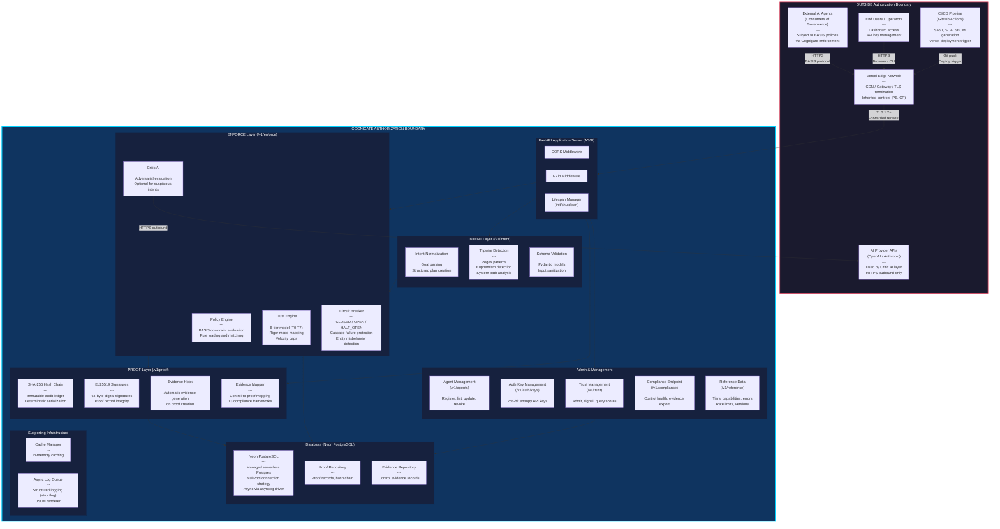

# Cognigate Authorization Boundary Diagram

**Document:** Authorization Boundary Diagram
**System:** Vorion Cognigate -- AI Agent Governance Runtime
**SSP Reference:** NIST SP 800-53 Rev 5 Moderate Baseline
**Last Updated:** 2026-02-20

## Description

This diagram defines the authorization boundary for the Vorion Cognigate system. Components inside the boundary are directly managed, configured, and secured by Vorion. Components outside the boundary interact with Cognigate but are not part of the assessed system. Inherited controls from cloud providers (Vercel/AWS) are noted where applicable.

## Diagram

## Legend

| Component | Boundary Status | Description |
|-----------|----------------|-------------|
| **FastAPI Application Server** | Inside | Core ASGI application with CORS and GZip middleware |
| **INTENT Layer** | Inside | Goal normalization, tripwire detection, schema validation |
| **ENFORCE Layer** | Inside | Policy engine, trust engine, Critic AI, circuit breaker |
| **PROOF Layer** | Inside | SHA-256 hash chain, Ed25519 signatures, evidence generation |
| **Admin & Management** | Inside | Agent lifecycle, API keys, trust scoring, compliance endpoints |
| **Neon PostgreSQL** | Inside (Managed) | Serverless PostgreSQL with NullPool; managed by Neon |
| **External AI Agents** | Outside | Consumers of Cognigate governance; subject to BASIS policies |
| **AI Provider APIs** | Outside | OpenAI/Anthropic APIs used by Critic for adversarial evaluation |
| **Vercel Edge Network** | Outside (Inherited) | CDN, TLS termination, DDoS protection; 16 PE controls inherited |
| **End Users / Operators** | Outside | Human operators accessing dashboard and API management |
| **CI/CD Pipeline** | Outside | GitHub Actions for SAST, SCA, SBOM, and deployment |

## Inherited Controls

The following control families are partially or fully inherited from cloud infrastructure providers:

- **Physical and Environmental Protection (PE):** 16 controls inherited from Vercel/AWS
- **Contingency Planning (CP):** Multi-region failover inherited from Vercel
- **System and Communications Protection (SC):** TLS 1.2+ termination at Vercel Edge

## Rendering

Render this diagram with any Mermaid-compatible viewer (GitHub, VS Code Mermaid extension, mermaid.live, or similar).
