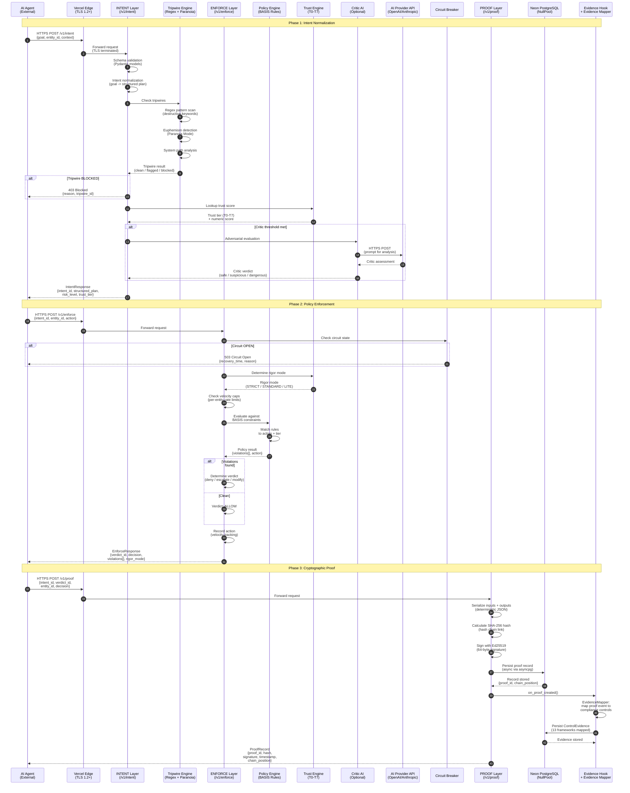

# Cognigate Data Flow Diagram

**Document:** Data Flow Diagram -- Request Lifecycle
**System:** Vorion Cognigate -- AI Agent Governance Runtime
**SSP Reference:** NIST SP 800-53 Rev 5 Moderate Baseline
**Last Updated:** 2026-02-20

## Description

This diagram traces the complete lifecycle of an AI agent governance request through Cognigate. It shows how an agent intent flows through the INTENT, ENFORCE, and PROOF layers, including conditional paths for the Critic AI evaluation, circuit breaker checks, and cryptographic proof generation.

## Diagram

## Flow Summary

### Phase 1: Intent Normalization (`/v1/intent`)
1. Agent submits a goal description via HTTPS
2. Vercel Edge terminates TLS and forwards to the FastAPI application
3. Pydantic schema validation ensures well-formed input
4. Intent is normalized into a structured plan with risk assessment
5. Tripwire engine scans for destructive patterns, euphemisms, and system paths
6. Trust engine provides the agent's current trust tier (T0-T7)
7. If the intent meets the Critic threshold (suspicious or high-risk), the Critic AI sends an adversarial evaluation prompt to an external AI provider
8. Response includes the intent_id, structured plan, risk level, and trust tier

### Phase 2: Policy Enforcement (`/v1/enforce`)
1. Agent submits the intent_id and proposed action
2. Circuit breaker is checked first -- if OPEN, request is immediately rejected (503)
3. Trust engine determines the rigor mode: STRICT (T0-T2), STANDARD (T3-T4), or LITE (T5-T7)
4. Velocity caps enforce per-entity rate limits
5. Policy engine evaluates the action against loaded BASIS constraints
6. Verdict is one of: ALLOW, DENY, ESCALATE, or MODIFY
7. Action is recorded for velocity tracking

### Phase 3: Cryptographic Proof (`/v1/proof`)
1. Agent submits the enforcement decision for proof generation
2. Inputs and outputs are serialized to deterministic JSON (sorted keys)
3. SHA-256 hash is calculated, linking to the previous record in the chain
4. Ed25519 signature is applied for tamper-evidence
5. Proof record is persisted to Neon PostgreSQL via asyncpg (NullPool)
6. Evidence Hook fires automatically, invoking the Evidence Mapper
7. Evidence Mapper determines which compliance controls the proof event satisfies (across 13 frameworks)
8. ControlEvidence records are persisted alongside the proof
9. Agent receives the proof_id, hash, signature, and chain position

## Data Classification

| Data Element | Classification | Protection |
|-------------|---------------|------------|
| Agent goals / intents | MODERATE | TLS in transit, access-controlled at rest |
| Trust scores | MODERATE | Computed at runtime, cached in-memory |
| Policy rules | LOW | Loaded from configuration, version-controlled |
| Proof records | HIGH (integrity) | SHA-256 hash chain + Ed25519 signatures |
| Evidence records | MODERATE | Database access controls, audit logged |
| API keys | HIGH (confidentiality) | 256-bit entropy, hashed storage |
| Critic AI prompts | MODERATE | HTTPS to provider, no PII transmitted |

## Rendering

Render this diagram with any Mermaid-compatible viewer (GitHub, VS Code Mermaid extension, mermaid.live, or similar).
