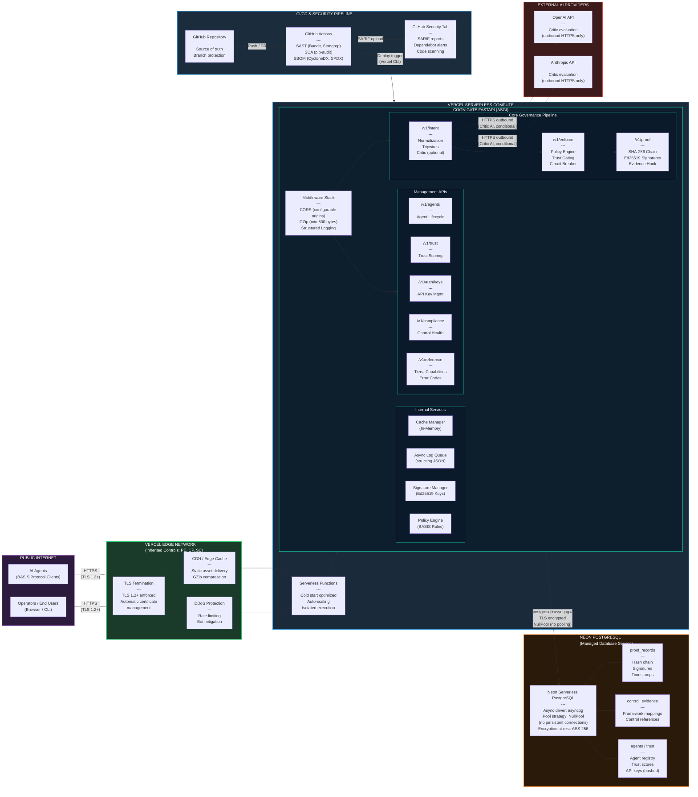

# Cognigate Network Architecture Diagram

**Document:** Network Architecture and Deployment Topology
**System:** Vorion Cognigate -- AI Agent Governance Runtime
**SSP Reference:** NIST SP 800-53 Rev 5 Moderate Baseline
**Last Updated:** 2026-02-20

## Description

This diagram shows the network topology and deployment architecture of Vorion Cognigate. It maps the flow of traffic through network zones, identifies encryption boundaries, and shows how each component communicates. The system is deployed on Vercel serverless infrastructure with Neon PostgreSQL as the managed database.

## Diagram

## Network Zones

| Zone | Components | Security Controls |
|------|-----------|-------------------|
| **Public Internet** | AI Agents, End Users | No trust assumed; all traffic encrypted via TLS |
| **Vercel Edge Network** | CDN, TLS Termination, DDoS Protection | TLS 1.2+ enforced, automatic certificate management, rate limiting |
| **Vercel Serverless Compute** | Serverless Functions, Cognigate ASGI | Isolated execution environment, auto-scaling, cold start optimization |
| **Neon PostgreSQL** | Database, Proof Records, Evidence, Agents | AES-256 encryption at rest, TLS in transit, NullPool connections |
| **External AI Providers** | OpenAI, Anthropic APIs | Outbound HTTPS only; used conditionally by Critic AI |
| **CI/CD Pipeline** | GitHub, Actions, Security Tab | Branch protection, SAST/SCA scanning, SARIF reporting |

## Connection Details

| Source | Destination | Protocol | Port | Notes |
|--------|------------|----------|------|-------|
| AI Agents | Vercel Edge | HTTPS | 443 | TLS 1.2+ required |
| Operators | Vercel Edge | HTTPS | 443 | TLS 1.2+ required |
| Vercel Edge | Serverless Functions | Internal | -- | Vercel internal routing |
| Cognigate | Neon PostgreSQL | postgresql+asyncpg | 5432 | TLS encrypted, NullPool strategy |
| Cognigate | OpenAI/Anthropic | HTTPS | 443 | Outbound only, conditional (Critic) |
| GitHub Actions | Vercel | HTTPS | 443 | Deploy via Vercel CLI |
| GitHub Actions | GitHub Security | Internal | -- | SARIF upload for code scanning |

## Database Connection Strategy

Cognigate uses **NullPool** for database connections, meaning no persistent connection pool is maintained. Each request opens a new connection and closes it when complete. This is the correct strategy for serverless deployments where:

- Function instances are ephemeral and may not persist between requests
- Connection pool state cannot be reliably maintained across cold starts
- Neon PostgreSQL handles connection management on the server side

Connection string format: `postgresql+asyncpg://{user}:{password}@{host}/{database}?sslmode=require`

## Encryption Boundaries

| Boundary | Encryption | Standard |
|----------|-----------|----------|
| Client to Vercel Edge | TLS 1.2+ | Automatic certificate via Let's Encrypt |
| Vercel to Cognigate | Internal TLS | Vercel platform security |
| Cognigate to Neon PostgreSQL | TLS (sslmode=require) | Server-side certificate validation |
| Cognigate to AI Providers | HTTPS/TLS 1.2+ | Provider certificate validation |
| Data at rest (Neon) | AES-256 | Neon managed encryption |
| Proof records (integrity) | Ed25519 signatures | RFC 8032 digital signatures |
| Hash chain (integrity) | SHA-256 | Deterministic JSON serialization |

## Rendering

Render this diagram with any Mermaid-compatible viewer (GitHub, VS Code Mermaid extension, mermaid.live, or similar).
