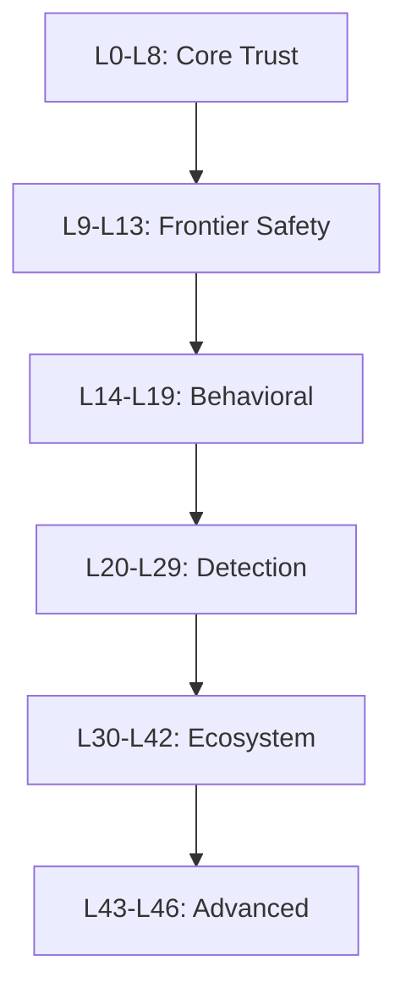

# ATSF - Agentic Trust Scoring Framework

**AI agent safety, governance, and cognitive architecture. (Beta)**

> **Status:** Trust Engine, LangChain integration, and CrewAI integration are production-ready. Security Pipeline has 6 concrete layer implementations (L0-L5 Input Validation tier) with more in progress. Intent and Enforcement services have both mock and real implementations. AutoGPT integration is planned.

[](https://github.com/vorionsys/vorion)
[](https://github.com/vorionsys/vorion/blob/master/LICENSE)
[](https://python.org)

---

## What is ATSF?

ATSF (Agentic Trust Scoring Framework) is a comprehensive framework for building trustworthy AI agents. It provides:

- **Security Layer Framework** - Defense-in-depth architecture from L0 trust scoring to L46 CI/CD gates (6 concrete layers implemented; remaining in progress)
- **Cognitive Cube** - Temporal Knowledge Graph, ART clustering, Granger causality
- **OLAP Analytics** - Multi-dimensional data cubes for agent memory
- **AI TRiSM** - Gartner-aligned Explainability, ModelOps, Security, Privacy
- **Real-time Events** - WebSocket streaming and pub/sub

## Quick Start

**Python:**

```python
from atsf import ATSF

# Initialize
atsf = ATSF()

# Create agent
agent = atsf.create_agent("my_agent", "my_creator", tier="gray_box")

# Execute with trust scoring
result = agent.execute("read", {"target": "data.txt"})
print(f"Decision: {result.decision}")
print(f"Trust: {result.trust_score:.3f}")
```

**TypeScript:**

```typescript
import { ATSF } from '@vorionsys/atsf';

const atsf = new ATSF({ baseUrl: 'http://localhost:8000' });

const agent = await atsf.createAgent('my_agent', 'my_creator');
const result = await agent.execute('read', { target: 'data.txt' });

console.log(`Decision: ${result.decision}`);
console.log(`Trust: ${result.trustScore.toFixed(3)}`);
```

**REST API:**

```bash
# Create agent
curl -X POST http://localhost:8000/agents \
  -H "Content-Type: application/json" \
  -d '{"agent_id": "my_agent", "creator_id": "my_creator"}'

# Execute action
curl -X POST http://localhost:8000/actions \
  -H "Content-Type: application/json" \
  -d '{"agent_id": "my_agent", "action_type": "read", "payload": {"target": "data.txt"}}'
```

## Key Features

### Trust Tiers

| Tier | Ceiling | Description |
|------|---------|-------------|
| `black_box` | 0.40 | No transparency, lowest trust |
| `gray_box` | 0.60 | Partial transparency |
| `white_box` | 0.80 | Full transparency |
| `verified_box` | 0.95 | Audited and verified |

### Security Layers



### Framework Integrations

- **LangChain** - Callback handler and tool wrapper (production-ready)
- **CrewAI** - Multi-agent crew governance (production-ready)
- **AutoGPT** - Command trust gating (planned)
- **LlamaIndex** - Coming soon

## Installation

```bash
pip install atsf
```

Or with optional dependencies:

```bash
pip install atsf[redis,opentelemetry]
```

## Statistics

| Metric | Value |
|--------|-------|
| Lines of Code | 32,000+ |
| Python Modules | 33 |
| Tests | 380+ |
| Security Layers | 46 defined (6 concrete implementations; remaining in progress) |
| API Endpoints | 45+ |

## Documentation Sections

### Getting Started

Install ATSF and run your first trust-scored agent in minutes.

[Quick Start](getting-started/quickstart)

### Security Layers

Deep dive into the 46 security layer definitions and the framework architecture.

[Security Reference](security/layer-reference)

### STPA-TRiSM Integration

Learn how STPA hazard analysis maps to AI TRiSM governance pillars.

[STPA-TRiSM Mapper](integration/stpa-trism-mapper)

### Roadmap

See what is coming next for ATSF in 2026 and beyond.

[Roadmap 2026](roadmap)

## Community

- **GitHub**: [github.com/vorionsys/vorion](https://github.com/vorionsys/vorion)
- **Discord**: [Join our community](https://discord.gg/basis-protocol)

---

*The constitution is no longer a suggestion. It is architecture.*
